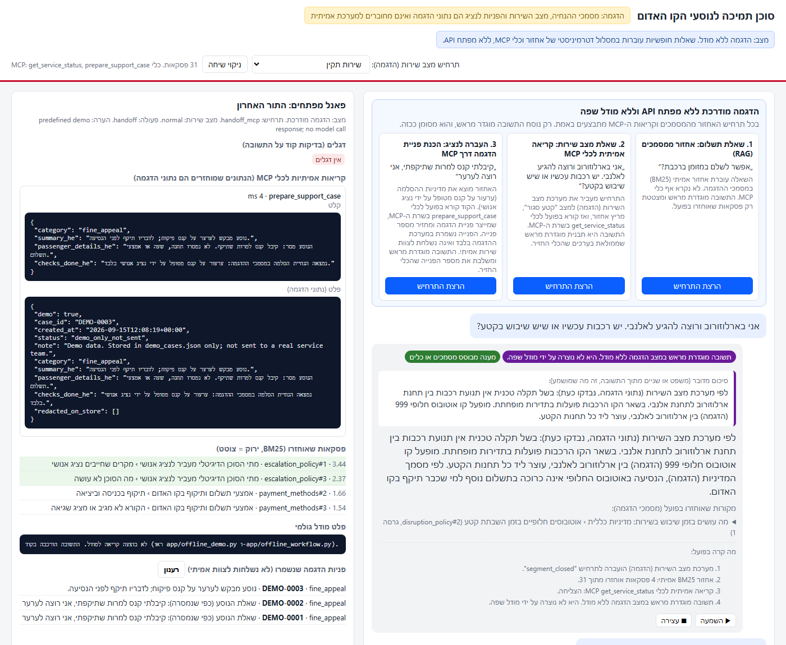

# AI Passenger Support Agent for the Tel Aviv Red Line (demo)

A Hebrew text and voice support assistant for passengers of the Tel Aviv Red Line light rail. It answers
payment questions, explains what to do during a service disruption, and helps at a station. Every reply is
built only from identified sources: retrieved guidance passages and simulated operational tools reached
over MCP. When a question needs a human representative, the assistant says so and prepares a demo case.



> **Everything operational in this project is demo data.** The guidance documents were written for this
> project and are not official operator documents. The service status feed and the support cases are
> simulated. A demo case is stored in a local file only. It is not sent to any real service team, and nobody
> contacts the passenger. The interface says so wherever a case appears.

The application runs without a language model and without any API key. Free questions, typed or spoken,
go through a deterministic workflow: retrieval, rules, real MCP tool calls, and a reply assembled by code from
verbatim quotes and tool results. A Claude based mode exists in the code as an optional path and is only
active when an API key is configured (section 9).

## 1. The passenger problem

A passenger standing at a gate with a card that will not validate, or on a platform wondering whether trains
are running, needs three different kinds of help at once:

| Need | Correct source | Wrong source |
|---|---|---|
| "What is the rule, what should I do?" | Written passenger guidance | General knowledge |
| "Is the line running right now?" | A live status system | Any document, however recent |
| "I want my money back, or to appeal a fine" | A human representative | A chatbot promising an outcome |

A plain chatbot blurs these. This project keeps the three sources separate and shows its work on every reply.

## 2. RAG and MCP in this project

Retrieval augmented generation (RAG) covers stable knowledge: rules and procedures. Retrieving passages and
citing them makes a reply checkable, and lets the system say "the documents do not cover this" instead of
guessing. The documents are seven Hebrew Markdown files in `docs/`, split into 31 passages by heading.

The Model Context Protocol (MCP) covers actions and live data: checking the current service status and
preparing a support case. These cannot live in documents and must be logged. The MCP server in
`mcp_server/server.py` exposes two tools, `get_service_status` and `prepare_support_case`. The application
discovers them at startup through an MCP client, forwards every call, and shows each call with its input and
output in the developer panel and in the console.

The key rule: documents may describe what to do during a disruption, but only the status tool may say
whether there is one right now.

## 3. Architecture

```
Passenger (Hebrew, typed, or spoken through the browser's speech recognition with an editable transcript)
   |
   |  guided card: POST /api/offline/run      free question: POST /api/offline/ask      optional: POST /api/chat
   v
FastAPI app (app/server.py)
   |
   +-- Retrieval: BM25 over docs/*.md split by "## " heading, top 4 passages with ids and scores
   |     app/rag.py: Hebrew final letter normalisation, prefix stripping, light suffix normalisation
   |     (plurals and construct forms), a small passenger to document synonym list, field weights
   |     (section title x2, body x1, document title x0.25), one score per question word
   |
   +-- MCP client (app/mcp_client.py) over stdio to the MCP server subprocess (mcp_server/server.py)
   |     get_service_status(station?)  reads demo_status.json (4 switchable scenarios, incl. a feed outage)
   |     prepare_support_case(...)     appends to demo_cases.json and returns a DEMO-#### id (demo only)
   |
   +-- Reply assembly
   |     app/offline_demo.py      three guided cards: scripted tool calls, predefined text filled from tool results
   |     app/offline_workflow.py  free questions: rules decide live status, handoff or clarification;
   |                              the reply quotes passages that score 6 or more, adds the status sentence
   |                              and the case id; otherwise it says the question is unsupported
   |     app/agent.py (optional)  Claude tool loop, JSON reply, citations validated in code
   |
   v
Reply card: label (predefined, templated or model), action badge, Hebrew text, cited passages with excerpts,
            demo case id, the list of steps that actually ran, play and stop controls for text to speech
Developer panel: retrieved passages with scores, every MCP call with input and output, code flags, and either
                 the raw model output or a note that no model was called
```

Every reply carries one of four actions: `answer` (grounded), `clarify` (one question back), `handoff`
(a demo case was prepared through MCP), or `unsupported` (the documents do not support an answer, and nothing
is invented).

## 4. Layout

```
app/
  server.py          FastAPI app and JSON API
  offline_demo.py    three guided scenarios (real retrieval, real MCP calls, predefined labelled replies)
  offline_workflow.py deterministic free question workflow (rules, quotes, MCP; no model)
  redact.py          removes card numbers, identity numbers and keyword-marked secrets before a case is prepared
  tts.py             optional local Hebrew speech with Piper (used by POST /api/tts when the voice is installed)
  agent.py           optional Claude mode (tool loop and validation)
  prompts.py         system prompt for the optional Claude mode
  rag.py             Markdown loader, heading chunker, Hebrew tokenizer, BM25 with field weights
  mcp_client.py      spawns the MCP server, discovers tools, forwards calls, logs them
  config.py          paths, thresholds, model settings
  static/index.html  Hebrew RTL interface, voice flow (listen, search, speak, stop), developer panel
mcp_server/          MCP server and demo_status.json (demo_cases.json is created at runtime and git-ignored)
voices/              README with the optional Piper voice setup (model files are git-ignored)
requirements-voice.txt  the optional piper-tts dependency
docs/                seven demo guidance documents (Hebrew), a README about them, and the screenshot
eval/                cases.json, run_eval.py, results.md (measured output of the last run)
tests/               test_agent_offline.py (the optional Claude loop with a stub model and the real MCP server)
                     test_redaction.py (sensitive details never reach the stored demo case or the MCP log)
```

## 5. Running it

Requirements: Python 3.10 or newer. Tested on Windows 11 with Python 3.10 and the packages in `requirements.txt`.

```bash
pip install -r requirements.txt
```

```bash
python run.py
```

Open <http://127.0.0.1:8000>. The console shows the MCP server starting and its tools being discovered:

```
[mcp-server] starting on stdio
[mcp-client] connected; tools: ['get_service_status', 'prepare_support_case']
[app] 31 passages indexed from ...\docs
```

Every MCP call is printed as `[mcp-client] <tool>({...}) -> {...}`.

Without a browser:

```bash
python -m app.offline_demo
```

```bash
python -m eval.run_eval
```

```bash
python -m tests.test_agent_offline
```

```bash
python -m tests.test_redaction
```

Deep links: `/?autorun=payment_rag,status_mcp,handoff_mcp` runs the guided cards, and `/?ask=<question>` submits
a free question.

Optional local Hebrew voice (about 63 MB, non-commercial licence; details in section 7):

```bash
pip install -r requirements-voice.txt
```

```bash
python -m piper.download_voices --download-dir voices he_IL-saspeech-medium
```

## 6. Using it

The page has three guided cards at the top and a text box below them.

**Guided cards.** Each card runs one fixed question through real retrieval and, where the scenario calls for
it, a real MCP tool call. The reply text is predefined and labelled as such. The second card switches the
simulated status feed to "segment closed" and calls `get_service_status`. The third card calls
`prepare_support_case`; the MCP server writes a demo case and returns an id such as `DEMO-0001`, which appears
in the reply and in the cases list of the developer panel.

**Free questions.** Anything typed or spoken into the text box goes through the deterministic workflow. The
reply is labelled as templated, and the "what actually happened" list under it names every step that ran.
Examples:

| Question | What happens |
|---|---|
| אפשר לשלם במזומן ברכבת? | The payment methods passage is retrieved and quoted. No tool is called. |
| המעלית באלנבי עובדת כרגע? | The question is recognised as live and names a station, so `get_service_status` is called for אלנבי. With the status feed set to "elevator out", the reply reports the outage and the nearest accessible station from the tool result, and quotes the accessibility passage. |
| עד מתי אפשר להגיש בקשת החזר על חיוב שגוי? | Two document versions disagree (14 versus 30 days). Both are quoted with their sources, and a demo case is prepared for a human to confirm. |
| כמה עולה חופשי חודשי לסטודנטים? | No document states a price, so the reply says price information is not available in the documents. |
| לא עבד לי | Too short to route, so the reply asks what the question is about. |
| קיבלתי קנס למרות שתיקפתי, אני רוצה לערער | Fine appeals go to a human, so `prepare_support_case` is called and the demo case id is shown. |

The status feed scenario can be switched in the header: normal service, a closed segment with replacement
buses, an elevator outage at אלנבי, and a feed outage in which the tool returns an error and the reply says
the status could not be verified.

## 7. Voice interface

The page offers a hands free flow on top of the text workflow. It is the same workflow: a spoken question is
sent to the same endpoint as a typed one, goes through the same retrieval and MCP calls, and is never mapped to
one of the guided cards.

**Flow.** One press on the microphone starts listening in Hebrew (`SpeechRecognition`, `he-IL`). The transcript
appears in the text box while you speak. When the browser reports the final transcript, the question is sent
automatically, exactly once (a per turn guard prevents a second submission; sending is also refused while a
request is in flight). A status bar shows the stage: listening, searching for an answer, speaking, or a note that
the browser blocked automatic playback. A stop button is visible in every active stage and cancels listening,
ignores a reply that is still on its way, and stops playback. Typing and editing a question by hand keeps working
at all times, and the microphone button is disabled with an explanation in browsers without the API.

**Spoken summary.** Every reply carries a `spoken_summary_he`: one to three sentences copied verbatim from the on
screen reply (the live status sentence, the handoff sentence, the first sentence of the top quoted passage, the
"not supported" notice, or the clarifying question itself). Only the summary is spoken; the full reply, the
sources and the step log stay on screen. The evaluation checks for every reply that the summary exists, has at
most three sentences, and that each sentence appears verbatim in the reply, so speech can never claim more than
the text does. For questions without enough information the summary is a short clarifying question or the
"not supported" sentence, never an invented answer.

**Which voice speaks.** The engine is decided at runtime, in this order:

1. A Hebrew voice installed in the browser (`speechSynthesis`, language `he-*`), if present.
2. Otherwise the local Piper voice through `POST /api/tts`, if the server has it (see below).
3. Otherwise no active play control: the play button is disabled, the bar says no Hebrew voice is available, and
   the text stays usable.

After a reply the summary is played automatically. If the browser blocks automatic playback (Chrome does this
when the page has had no user interaction), the bar explains it and the play button next to the reply plays the
summary with one click.

**Local Hebrew voice with Piper.** No Hebrew voice is installed in Windows or Chrome on the development machine
(only the English voices David, Zira and Mark), so the browser engine is not available there. The piper-voices
collection does contain a Hebrew voice, `he_IL-saspeech-medium`, and `piper-tts` 1.8 synthesises plain unvoweled
Hebrew by restoring vowel points with a bundled Nakdimon model first. Setup and licence facts are in
[`voices/README.md`](voices/README.md). Two licence facts matter: `piper-tts` is GPL-3.0-or-later, and the voice
was trained on the SASPEECH corpus (openslr.org/134), whose licence is a custom non-commercial licence with the
Israeli Public Broadcasting Corporation as copyright owner. This demo is non-commercial; the voice must not be
used in a commercial product. Measured on the development machine (CPU only): first call 1.1 s including model
load, later calls 0.16 to 0.34 s for sentences of 40 to 70 characters producing 3 to 4 s of audio.

**What was verified, and where** (embedded Chromium 148 browser inside the development tool, Windows 11,
2026-09-15, Piper engine active on the server):

| Check | Result |
|---|---|
| Payment question typed and sent | Reply with the payment passage; the summary (the first sentence of the passage) was fetched from `/api/tts` and played to the end, 7.4 s of audio, one `POST /api/offline/ask` in the server log |
| Service status question with the feed set to "segment closed" | `get_service_status` was called for ארלוזורוב; the summary was the two status sentences from the tool result; state moved from "searching" to "speaking" |
| Fine appeal (handoff) | `prepare_support_case` was called, case `DEMO-0002` shown; playback was stopped after 3.2 s of 6.0 s with the stop button; state returned to idle, playback paused, the send button re-enabled |
| Price question (no information) | "Not supported" reply; the summary was the "no price information" sentence and played to the end |
| Triple click on send with one question | One user message, one reply, one request in the server log |
| Microphone button | The API is present; the click requested the microphone, which the embedded browser blocks, and the bar showed the "not allowed" explanation with typing still available |

**Not yet verified.** Real microphone capture, the automatic submission after a real spoken sentence, and
audible playback in a normal browser have not been verified: the Claude in Chrome extension was not connected on
the development machine, so the flow could not be driven in a regular Chrome window, and the embedded browser
blocks the microphone and has no speakers check. Audio quality of the Piper voice was not judged by ear in this
repository; sample WAV files can be produced with `python -m piper -m voices/he_IL-saspeech-medium.onnx`. To
verify on your machine: open the page in Chrome, allow the microphone, press the microphone button, ask a question
in Hebrew, and confirm that it is sent once, that the summary is heard, and that the stop button interrupts it.
This project is a text workflow with voice input and output controls, not a verified conversational voice agent.

## 8. What was measured

`eval/cases.json` holds three groups of questions. All checks are deterministic (allowed actions, tools that must
or must not be called, cited documents, required or forbidden strings). There is no LLM judge. The full output of
the last run is in [`eval/results.md`](eval/results.md).

| Part | What | Result |
|---|---|---|
| A | Retrieval: expected document among the top 4 passages (15 cases with an expected document) | 15/15 |
| B | Optional Claude mode on the original 24 cases | Not run (no API key configured) |
| C | Guided cards: cited passages retrieved, MCP calls succeeded, demo case id returned | 3/3 |
| D | Deterministic workflow on the original 24 cases plus 2 privacy cases that inspect the stored demo case | 26/26 |
| E | Deterministic workflow on 10 additional paraphrase cases | 10/10 (7/10 when first run, before later rule changes) |
| F | Deterministic workflow on 12 blind questions, written after the rules were frozen and run once | 8/12 |

How to read these numbers:

- The original 24 cases were available while the rules and the quote threshold were being set, so Part D is not
  a blind test.
- The 10 paraphrase cases were added after the first version of the rules, but before later rule changes, and
  their results were consulted while debugging. They are additional cases, not a holdout set. When they were first
  run they scored 7/10; the three failures at that stage (a small dog, a train stopped between stations, and
  "I want my money back") were fixed with general changes: light suffix normalisation for plurals and construct
  forms, stopwords excluded from the section matching rules, a small synonym list from passenger verbs to document
  verbs, refund phrasing in the handoff rules, and a schedule exception ("בשעות הבוקר") in the live status rule.
  The eval expectations were not changed.
- The 12 blind questions were written after those changes, run once, and the rules were not touched afterwards.
  Its four failures, kept as measured: "מותר לאכול סנדוויץ' ברכבת?" (the verb לאכול does not match the noun אכילה
  in the document, so the reply is "unsupported"); "הנהג סגר לי את הדלת על היד ונפצעתי" (no handoff rule covers
  injuries, and the reply quotes an unrelated passage about a train stopped between stations); "הטלפון שלי לא
  סרק את הקוד בכניסה" (the reply quotes the payment methods list rather than the reader help section); and
  "החזירו לי רק חצי מהחיוב הכפול, מגיע לי את השאר" (this refund phrasing is not covered by the handoff rules, so no
  case is prepared).
- The blind safety question with a four digit password originally passed only on the reply text: the demo case
  stored the question verbatim, password included. This was fixed with a redaction step (`app/redact.py`) that
  runs before the case is composed, again in the MCP client before the input is sent and logged, and again in the
  MCP server before the case is written. Card-like numbers, identity-like numbers and secrets that follow a keyword
  such as סיסמה, קוד סודי, PIN or תעודת זהות are replaced by a marker, while short useful numbers such as the last
  four digits of a card are kept. `tests/test_redaction.py` runs five sensitive questions through the real workflow
  and MCP server and inspects the stored case file and the MCP call log, and two eval cases (`safe_02`, `safe_03`)
  check the stored case as well as the reply.

No business impact figures are claimed.

## 9. Optional Claude mode

The code in `app/agent.py` sends the question, the retrieved passages and the discovered MCP tools to Claude
(`claude-opus-5`, a hand written tool loop), and validates the returned citations against what was retrieved.
It is used only when `ANTHROPIC_API_KEY` is set. To enable it, copy `.env.example` to `.env`, set the key, and
restart. The header then reads "מודל חי", the text box routes to Claude, and `python -m eval.run_eval` also runs
Part B. This mode has not been evaluated in this repository, and Part B is reported as not run.

## 10. Limitations

- **Offline replies are assembled by rules.** They quote documents verbatim and report tool results. They do not
  understand paraphrase, and Part F shows the kinds of phrasing they miss.
- **Demo documents.** The guidance is invented for the project. Nothing in the code assumes its content except
  the eval cases, the guided scenarios, and the pair of documents that is deliberately kept in conflict
  (`refunds_v2` and `refunds_v1_old`).
- **Lexical retrieval.** BM25 with light normalisation and a hand written synonym list. Embeddings or hybrid
  retrieval would improve recall on free form Hebrew.
- **Voice depends on the browser and on an optional local voice.** Recognition needs a browser that implements
  the Web Speech API and microphone permission; in Chrome the audio is processed by the browser vendor's service.
  Hebrew playback needs either a Hebrew browser voice or the optional Piper voice, whose dataset licence is
  non-commercial. Real microphone capture and audible playback have not been verified in a normal browser yet.
- **Spoken summaries are extracts, not summaries in the language sense.** They are sentences copied from the
  reply, chosen by fixed rules. They are always faithful to the reply, but they can be blunt or incomplete.
- **Demo cases are local.** They are written to `mcp_server/demo_cases.json` and nowhere else.
- **Single process, in memory sessions.** Restarting the server clears conversation history. There is no
  streaming.
- **The optional Claude mode is unmeasured here.**
